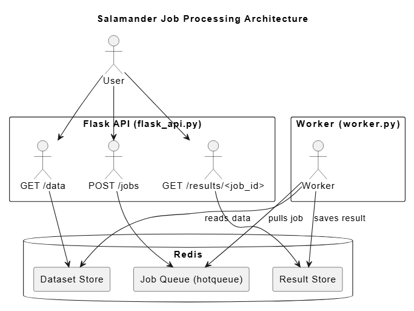
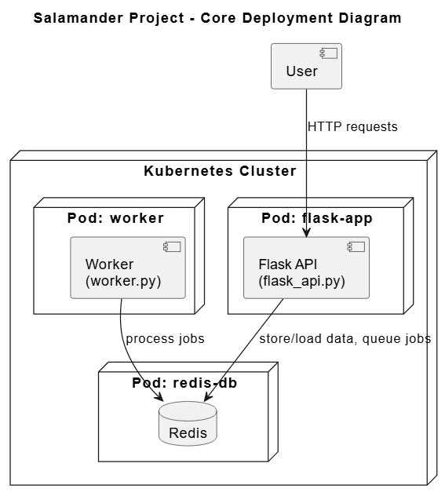

# **Salamander Population API & Asynchronous Job Processing**

## Overview
This project provides a **containerized REST API and asynchronous job processing system** for analyzing Barton Springs Salamander population data. Built with **Flask**, **Redis**, and **Docker**, it supports querying environmental data, exploring size distributions, and submitting background processing jobs for analysis over time.

---

## Features

- Load and store salamander population data in Redis
- Retrieve salamander size and condition info by year/month\
- Asynchronous job submission and result retrieval
- Fully containerized (Docker & Kubernetes compatible)
- Local testing and CI support with `pytest` and `Makefile`

---

## File Structure

```text
Barton-salamanders/
├── data/                           # Static or placeholder data files
├── diagram.png                     # System architecture diagram
├── docker-compose.yml              # Local container orchestration
├── Dockerfile                      # Flask app container definition
├── kubernetes/
|   ├── prod/                       # Kubernetes production YAMLS
|   └── test/                       # Kubernetes testing YAMLS
├── Makefile                        # Utilities for testing and container tasks
├── README.md                       # Overview and Instructions
├── requirements.txt                # Python package dependencies
├── src/
|   ├── salamander_api.py           # Flask app with all routes
|   ├── jobs.py                     # Job queue manager
|   └── worker.py                   # Redis-backed job processor
└── test/
    ├── test_salamander_api.py      # API route tests
    ├── test_jobs.py                # Job logic tests
    └── test_worker.py              # Worker queue & processing tests
```

---

## **API Routes**

### General

| Route | Method | Description |
|--------|-------|-------------|
| `/help` | GET | Show all available routes |

---

### Dataset Management

| Route | Method | Description | Example Command |
|---------|--------|------------|-----------------|
| `/data` | POST | Load salamander data into Redis | `curl -X POST HTTP://localhost:5000/data` |
| `/data` | GET | Retrieve full dataset from Redis | `curl HTTP://localhost:5000/data` |
| `/data` | DELETE | Remove all data from Redis | `curl -X DELETE HTTP://localhost:5000/data` |

---

### Salamander Queries

| Route                                | Method | Description                                  | Example Command |
|--------------------------------------|--------|----------------------------------------------|-----------------|
| `/salamanders`                        | GET    | Return all unique salamander sizes           | `curl http://localhost:5000/salamanders` |
| `/salamanders/years`                 | GET    | List all available years                     | `curl http://localhost:5000/salamanders/years` |
| `/salamanders/months/<year>`         | GET    | List available months in a given year        | `curl http://localhost:5000/salamanders/months/2007` |
| `/salamanders/conditions/<year>/<month>` | GET | Get environmental data for a given time      | `curl http://localhost:5000/salamanders/conditions/2007/05` |
| `/salamanders/sizes/<year>/<month>`  | GET    | View size distribution for a specific period | `curl http://localhost:5000/salamanders/sizes/2007/05` |

---

### Job Processing

| Route             | Method | Description                           | Example Command |
|-------------------|--------|---------------------------------------|-----------------|
| `/jobs`           | POST   | Submit a job for data analysis        | `curl -X POST http://localhost:5000/jobs   -H "Content-Type: application/json"   -d '{"year": "2004", "month": "11"}'` |
| `/jobs`           | GET    | List all submitted job IDs            | `curl -X GET http://localhost:5000/jobs` |
| `/jobs/<job_id>`  | GET    | Check job status and metadata         | `curl -X GET http://localhost:5000/jobs/135260d9-e5ad-4355-8e0f-4a0f9457e126` |
| `/results/<job_id>` | GET  | Retrieve the result of a completed job| `curl -X GET http://localhost:5000/results/135260d9-e5ad-4355-8e0f-4a0f9457e126` |

---

## **Deployment Instructions**

### **Replacing `<docker-username>` with Your Own Docker Hub Username**

In the `Makefile` and Kubernetes deployment files, you will need to replace `<docker-username>` with your actual Docker Hub username to ensure that your Docker images are correctly tagged and pushed to your account.

- **Makefile**: In the `Makefile`, there's a target that builds and pushes the Docker image. Replace the `<docker-username>` placeholder with your Docker Hub username to correctly tag your image:

  ```makefile
  IMAGE_NAME=<docker-username>/salamander-api

### Local Deployment (e.g., Jetstream)

1. **Build and Start the App**
```bash
make up
```

2. **Stop and Clean Up**
```bash
make down

OR

docker-compose down --volumes
docker system prune -a
```

3. **Run Unit Tests**
```bash
pytest
```

---

### Kubernetes Deployment
Assumes you have `kubectl`, a configured K8s cluster

1. **Log in to Docker Hub**
Before you begin, you need to be logged into Docker Hub (or your custom Docker registry) to push images. If you're not already logged in, run the following command:
```bash
docker login
```
You will be prompted to enter your Docker Hub username and password. After logging in, you can push images to your Docker Hub account.

2. **Build Docker Image**
Next, you need to build the Docker image for your application. Run the following command:
```bash
docker build -f Dockerfile -t <your-dockerhub-username>/salamander-api .
```
Make sure to replace `your-dockerhub-username>` with your actual Docker Hub username.

3. **Push Image to Docker Hub (or your registry)**
After the image is built, push it to Docker Hub:
```bash
docker push <your-dockerhub-username>/salamander-api
```

3. **Deploy with Kubernetes**
Now, you can deploy your application on Kubernetes. Use the following command to apply your deployment configurations
- Deploy Redis (the Redis service that will be used by the Flask app and the worker):
```bash
kubectl apply -f kubernetes/prod/app-prod-service-redis.yml
kubectl apply -f kubernetes/prod/app-prod-deployment-redis.yml
```
- Deploy Flask API Application:
```bash
kubectl apply -f kubernetes/prod/app-prod-deployment-flask.yml
kubectl apply -f kubernetes/prod/app-prod-service-flask.yml
kubectl apply -f kubernetes/prod/app-prod-service-nodeport-flask.yml
```
- Deploy Worker (the worker service that processes jobs):
```bash
kubectl apply -f kubernetes/prod/app-prod-deployment-worker.yml
```
- Create Persistent Volume Claim (PVC) for Redis:
```bash
kubectl apply -f kubernetes/prod/app-prod-pvc-redis.yml
```
- Set Up Ingress (Expose the Flask API via Ingress):
```bash
kubectl apply -f kubernetes/prod/app-prod-ingress-flask.
```

4. **Expose the API**
Once the services are deployed, you will need to expose your Flask API using Ingress. You should have a working Ingress controller.
- For testing locally, you can port-forward to test the API:
```bash
kubectl port-forward service/salamander-api 5000:5000
```
- For public access, after setting up Ingress, apply the Ingress resource to expose your application via your specified domain:
```bash
kubectl apply -f kubernetes/prod/app-prod-ingress-flask.yml
```

---

## **Using the Application**

### **Local Usage** (Jetstream)
Use `curl` to test endpoints:
```bash
curl http://localhost:5000/salamanders/years
curl http://localhost:5000/salamanders/sizes/2008/06
```

---

### **Public Usage** (with Ingress)
Once the Ingress is set up, the API should be available at your specified domain, for example, `salamander.coe332.tacc.cloud:30007`:
```bash
curl https://salamander.coe332.tacc.cloud:30007/salamanders/years
curl -X POST https://salamander.coe332.tacc.cloud:30007.org/jobs \
  -H "Content-Type: application/json" \
  -d '{"year": "2012", "month": "07"}'
```

---

### **Result Example**
```json
{
  "job_id": "abc123",
  "status": "completed",
  "summary": {
    "total_count": 138,
    "year": "2007",
    "month": "05"
  }
}
```

---

## **Testing the System**
Unit and integration tests are located in the `test/` directory.
Run them using:
```bash
pytest
```

---

## **Job Processing Architecture**
This diagram focuses on the asynchronous job pipeline. When a user submits a job through the Flask API, it's added to a Redis-backed queue. The background `worker` service continuously listens for new jobs, processes them, and stores the results back in Redis for later retrieval by the user. This decoupling allows the system to handle long-running computations efficiently without blocking the API.



---

## **Core Deployment Diagram**
This diagram illustrates the overall deployment architecture of the salamander monitoring system within a Kubernetes cluster. It shows how the `flask-app`, `worker`, and `redis-db` components are deployed in separate pods, communicating via a shared Redis service. Users interact with the system through the Flask API, which orchestrates data access and job submission.



---

## **AI-Assisted Development**
AI tools were used to help with initial setup and documentation, but all content was carefully reviewed and verified to ensure proper functionality.
